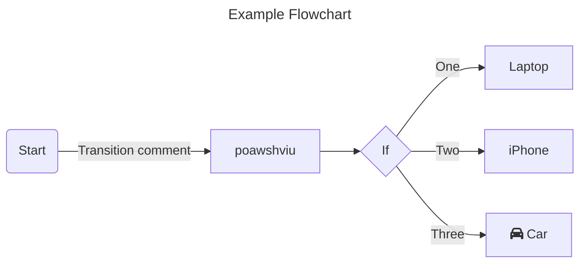

# Mermaid
Used for adding Graphs & Charts in Markdown pages

1. __Flow Charts:__
   - Flowcharts are composed of nodes (geometric shapes) and edges (arrows or lines).
   - 

   - creating nodes:
     - default:
       ```
       ```mermaid
           flowchart LR;
               id;
       ```
     - Node with Text:
       ```
       ```mermaid
           flowchart LR;
               id1[This is the Text];
       ```

   - Adding Markdown Text in graphs:
     - Use double quotes and backticks "` text `" to enclose the markdown text.
       ```
       ```mermaid
          %%{init: {"flowchart": {"htmlLabels": false}} }%%;
          flowchart LR;
             markdown["`This **is** _Markdown_`"];
             newLines["`Line1
             Line 2
             Line 3`"];
             markdown --> newLines;
       ```
   - __Direction:__
     -
     | Abbrevation | Full form     |
     |:-----------:|:-------------:|
     | TB          | Top to Bottom |
     | TD          | Top to Down   |
     | BT          | Bottom to Top |
     | RL          | Right to Left |
     | LR          | Left to Right |

     - Where to add:
       ```
       ```mermaid
       flowchart <Abbrevation>;
          Start --> Stop;
       ```
   - __Node Shapes:__
     - ```mermaid
       flowchart LR;
          id(Round Edges);
       ```
       ```
       ```mermaid
       flowchart LR;
          id1(text in the box);
       ```
     - ```mermaid
       flowchart LR;
          id([Stadium Edges]);
       ```
       ```
       ```mermaid
       flowchart LR;
          id1([text in the box]);
       ```
     - ```mermaid
       flowchart LR;
          id([Stadium Edges]);
       ```
       ```
       ```mermaid
       flowchart LR;
          id1([text in the box]);
       ```
     - ```mermaid
       flowchart LR;
          id[[subroutine Edges]];
       ```
       ```
       ```mermaid
       flowchart LR;
          id1[[text in the box]];
       ```
     - ```mermaid
       flowchart LR;
          id[(Cylindrical Edges)];
       ```
       ```
       ```mermaid
       flowchart LR;
          id1[(text in the box)];
       ```
     - ```mermaid
       flowchart LR;
          id((Stadium Edges));
       ```
       ```
       ```mermaid
       flowchart LR;
          id1([text in the box]);
       ```

     - ```mermaid
       flowchart LR;
          id((Stadium Edges));
       ```
       ```
       ```mermaid
       flowchart LR;
          id1([text in the box]);
       ```

     - ```mermaid
       flowchart LR;
          id((Stadium Edges));
       ```
       ```
       ```mermaid
       flowchart LR;
          id1([text in the box]);
       ```

     - ```mermaid
       flowchart LR;
          id((Stadium Edges));
       ```
       ```
       ```mermaid
       flowchart LR;
          id1([text in the box]);
       ```
