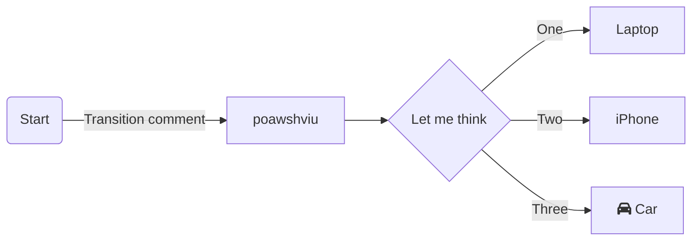

# Mermaid
Used for adding Graphs & Charts in Markdown pages



1. __Flow Charts:__
   - Flowcharts are composed of nodes (geometric shapes) and edges (arrows or lines).
   - creating nodes:
     - default:
       ```
       ```mermaid
           flowchart LR;
               id;

     - Node with Text:
       ```
       ```mermaid
           flowchart LR;
               id1[This is the Text]
