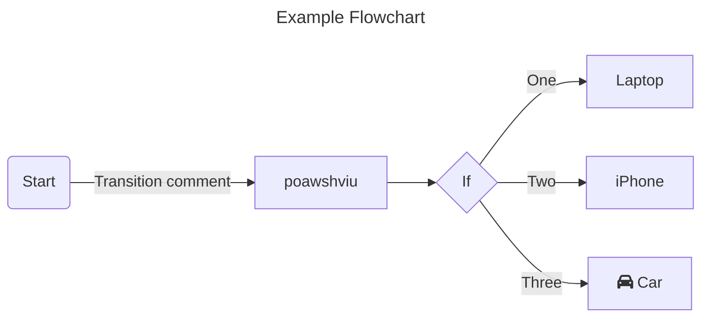

# Mermaid
Used for adding Graphs & Charts in Markdown pages

1. __Flow Charts:__
   - Flowcharts are composed of nodes (geometric shapes) and edges (arrows or lines).
   - 

   - creating nodes:
     - default:
       ```
       ```mermaid
           flowchart LR;
               id;
       ```
     - Node with Text:
       ```
       ```mermaid
           flowchart LR;
               id1[This is the Text];
       ```

   - Adding Markdown Text in graphs:
     - Use double quotes and backticks "` text `" to enclose the markdown text.
       ```
       ```mermaid
          %%{init: {"flowchart": {"htmlLabels": false}} }%%;
          flowchart LR;
             markdown["`This **is** _Markdown_`"];
             newLines["`Line1
             Line 2
             Line 3`"];
             markdown --> newLines;
       ```
   - __Direction:__
     -
     | Abbrevation | Full form     |
     |:-----------:|:-------------:|
     | TB          | Top to Bottom |
     | TD          | Top to Down   |
     | BT          | Bottom to Top |
     | RL          | Right to Left |
     | LR          | Left to Right |

     - Where to add:
       ```
       ```mermaid
       flowchart <Abbrevation>;
          Start --> Stop;
       ```
   - __Node Shapes:__
     -
     | Syntax         | Edge/Type     |
     |:--------------:|:-------------:|
     | ( <text> )     | Round corner  |
     | ([ <text> ])   | Stadium       |
     | [[ <text> ]]   | subroutine    |
     | [( <text> )]   | cylindrical   |
     | (( <text> ))   | Circle        |
     | > <text> ]     | Asymmetric    |
     | { <text> }     | Rhombus/Kite  |
     | {{ <text> }}   | Hexagon       |
     | [\ <text> \]   | Parallelogram |
     | [/ <text> /]   | Parall... alt |
     | [/ <text> \]   | Trapezoid     |
     | [\ <text> /]   | Trapezoid Alt |
     | ((( <text> ))) | Double Cicle  |

     - __How to use:__
       ```
       ```mermaid
       flowchart LR;
          id1<Syntax from above table>;
       ```
     - Extra Shapes(Introduced in v11.3.0+):
       - __Syntax:__
          ```
          A@{ shape: <Shape-name>, label: <Label to show>}
          ```
       - __Available Shapes:__
          [Check Them Out From Here](https://mermaid.js.org/syntax/flowchart.html)
     - Special Shapes(Icons and Images):
       - Adding Icons:
         - To use icons, you need to register the icon pack first. Follow the instructions
           provided [here](https://mermaid.js.org/config/icons.html). The syntax for defining
           an icon shape is as follows:
         - ```
           ```mermaid
           flowchart TD;
           A@{ icon: "fa:user", form: "square", label: "User Icon", pos: "t", h: 60 };
           ```
       - Adding Images:
         - You can use the image shape to include an image in your flowchart.
           The syntax for defining an image shape is as follows:
         - ```
           ```mermaid
           flowchart TD;
           A@{ img: "https://example.com/image.png", label: "Image Label",
           pos: "t", w: 60, h: 60, constraint: "off" };
           ```
   - __Links Between Nodes:__
     - Nodes can be connected with links/edges. It is possible to have
       different types of links or attach a text string to a link.
     -
     | Syntax         | Link Type     |
     |:--------------:|:-------------:|
     | ---            | Normal        |
     | -->            | with arrow    |
     | ===            | Thick         |
     | ==>            | Thick Arrow   |
     | -.-            | Dotted        |
     | -.->           | Dotted Arrow  |
     | ~~~            | Invisible     |
     | --o            | Circle Edge   |
     | --x            | Cross Edge    |
     | <->            | Double arrow  |
     | <=>            | Double arrow  |
     | x-x            | Double cross  |
     | o-o            | Double Circle |

     - Adding extra '-', '.', '=' will increase maximum length of that link.
   - __Sub-Graphs:__
     - Can be used to add nested graphs under Flow Charts.
     - Syntax:
       ```
       ```mermaid
       subgraph title
       graph definition
       end
       ```
